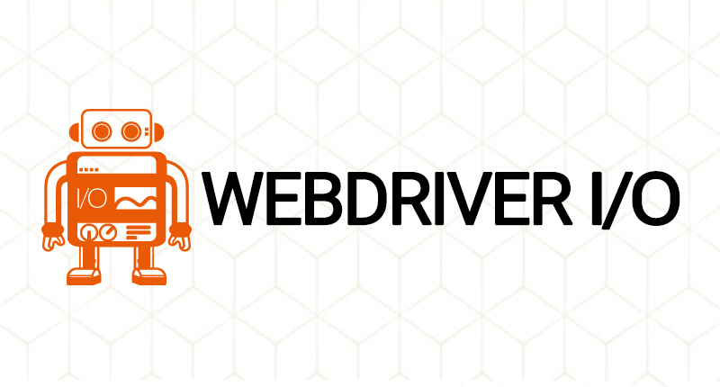
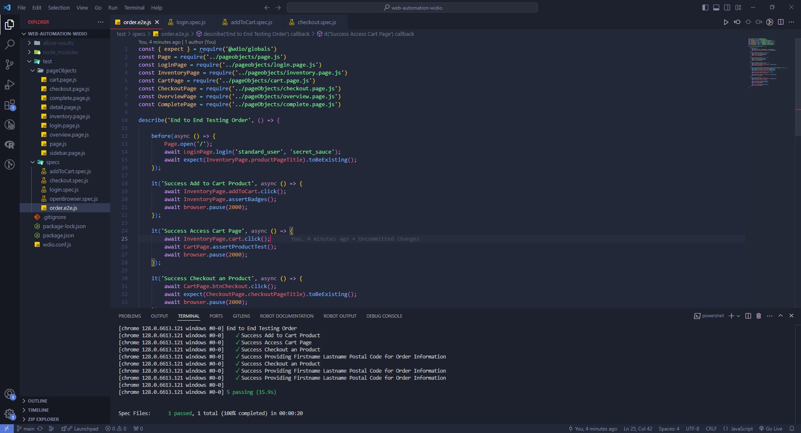

# Functional Web Automation Testing Using WebdriverIO on Saucedemo

Repository for Learning Software Quality Assurance - Web Automation Using WebdriverIO

    

This is a personal project focused on practicing functional web automation testing on the Saucedemo website using WebdriverIO. The goal of this project is to enhance skills in End-to-End (E2E) testing, covering critical user workflows such as login, adding a product to the cart, accessing the cart page, and completing the checkout process.The project leverages **mocha-framework** for structuring the test cases, **spec-reporter** for clear and readable test reporting, and **chromedriver** to run the tests in the Chrome browser.

## 🚀 Project Overview

The project spec includes:

- **Login**: Automating the login process with valid user credentials to validate access control.
- **Add to Cart**: Testing the functionality of adding products to the shopping cart.
- **Checkout**: Completing the checkout process, which includes entering user information, validating the order summary, and confirming the purchase.
- **End-to-End Order**: Automation testing for the order flow, from login to successfully ordering a product.

## Screenshot of Order Suite Report

## 📌 Current Status

The functional testing project has been running as expected, particularly with the `order.e2e.js` file, which successfully runs from start to finish. However, further additions to this project are planned in the future to enhance my skills in using WebdriverIO.

## 🛠️ Tools Used

- **WebdriverIO**: A powerful test automation framework used to create and execute test cases.
- **Mocha Framework**: The test framework used for the project.
- **Spec Reporter**: A WebdriverIO plugin to report in spec style.
- **ChromeDriver**: The tests are executed using the Chrome browser.
- **Saucedemo by Swag Labs**: The target website used for practicing web automation testing scenarios.

## 📈 Goals

- Enhance web automation skills using WebdriverIO.
- Improve understanding of E2E testing processes and best practices.
- Develop modular test cases to handle various user interactions and scenarios effectively.

## 🔗 Resources

- **Saucedemo by Swag Labs**: [Visit Website](https://www.saucedemo.com/)

## 🙏 Acknowledgements

Thank you for taking the time to explore this project! I appreciate any feedback, contributions, or suggestions to help me grow and improve my skills. 

Feel free to reach out, and happy testing!
